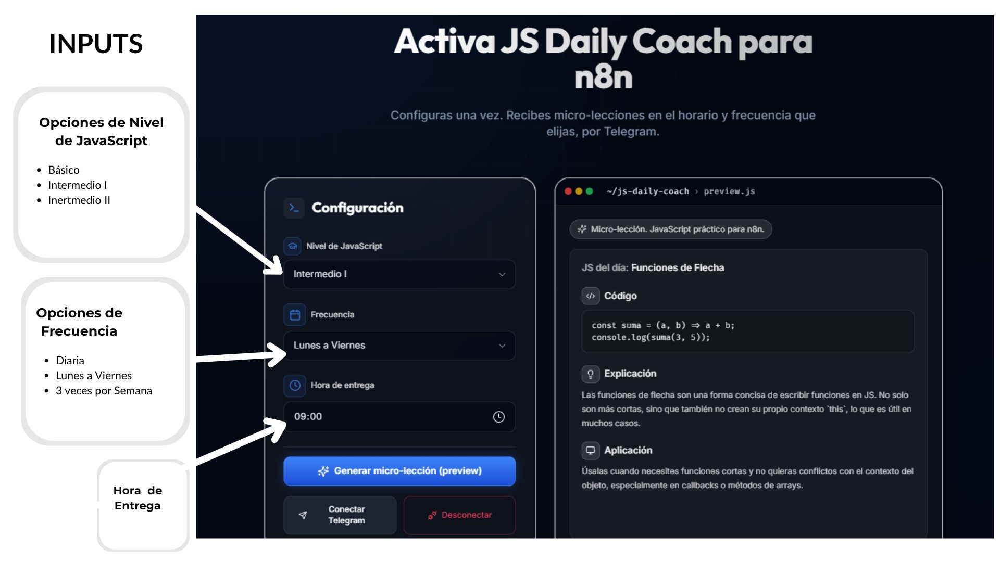
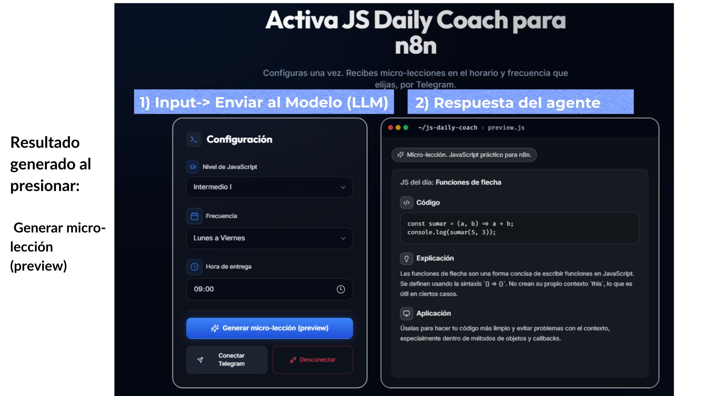

# JS Daily Coach para n8n (Sprint 3)

## Descripción breve del agente
**JS Daily Coach para n8n** es un agente que genera **micro-lecciones de JavaScript** con **un ejemplo de código pequeño y directo** para ayudar a entender y fijar conceptos que aparecen en flujos de **n8n**. El usuario configura **nivel**, **frecuencia** y **hora**, y la app muestra una lección con el formato: **JS del día**, **Código**, **Explicación** y **Aplicación**.

## Problema que resuelve
Personas que están aprendiendo JavaScript suelen perder continuidad: pasan días sin practicar, los conceptos se “enfrían” y luego se traban al leer o depurar código. Esto se vuelve más evidente cuando necesitan entender el JavaScript que aparece en automatizaciones de **n8n**, pero al no programar JavaScript a diario, se les dificulta mantener los conceptos frescos. **JS Daily Coach para n8n** resuelve esto con micro-lecciones breves y repetibles, enfocadas en un solo concepto, para mejorar comprensión y retención.

## Rol del agente
**Coach (operador automático):** entrega micro-lecciones breves, prácticas y sin relleno, con un ejemplo de código pequeño y directo. La dificultad y el tipo de ejemplo se ajustan al **nivel** seleccionado por el usuario y se enfocan en patrones que suelen aparecer en los nodos de **Code** de **n8n**.

## Flujo básico de uso
1. El usuario abre la web **Activa JS Daily Coach para n8n**.
2. Configura:
   - **Nivel de JavaScript** (Básico / Intermedio I / Intermedio II)
   - **Frecuencia** (Diaria / Lunes a Viernes / 3 veces por semana)
   - **Hora de entrega**
3. (Opcional) Presiona **“Conectar Telegram”** para vincular su cuenta y recibir envíos por Telegram.
4. Presiona **“Generar micro-lección (preview)”**.
5. La aplicación envía estos datos al backend, que llama a un modelo de lenguaje mediante la **OpenAI API**.
6. La respuesta se muestra en pantalla con el formato: **JS del día**, **Código**, **Explicación** y **Aplicación**.
7. El usuario puede repetir el flujo cambiando la configuración y generando una nueva micro-lección.

Nota: En esta versión (Sprint 3), la conexión con Telegram se muestra como parte del diseño UX, pero el objetivo evaluado es el flujo completo de generación (inputs → LLM → respuesta visible).

## Herramientas utilizadas
- **Replit** (desarrollo y ejecución del prototipo)
- **Node.js + Express** (backend)
- **React + TypeScript** (frontend)
- **OpenAI API** (generación dinámica de micro-lecciones)
- **Tailwind CSS** (estilos de la interfaz)
- **ChatGPT** (diseño de prompts y apoyo en depuración/ajustes del prototipo en Replit hasta obtener la versión final)

## Capturas de pantalla del prototipo funcionando
Las anotaciones en Canva se usan solo para resaltar inputs y el flujo; la interfaz mostrada corresponde al prototipo real corriendo en Replit.

- Captura 1 (config-inputs): Formulario de configuración

- Captura 2 (flow-end-to-end): Preview / Resultado generado 

