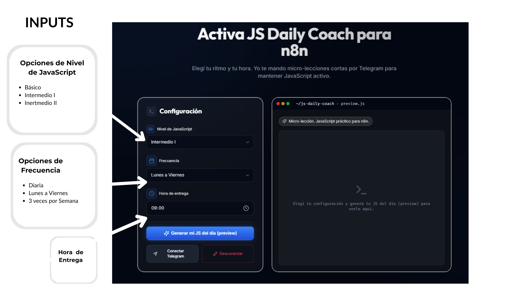
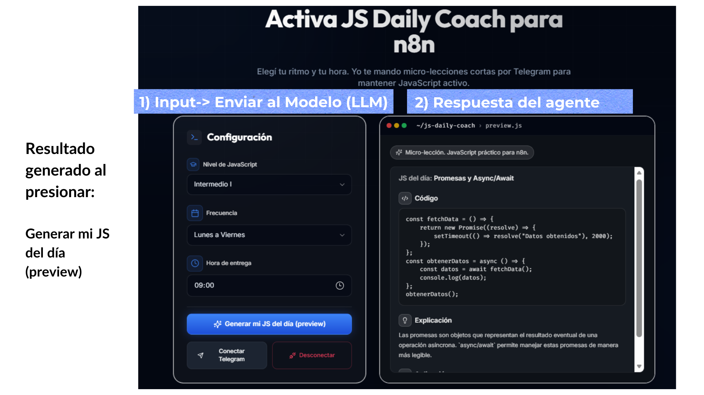

# JS Daily Coach para n8n (Sprint 3 + Fase 4)

## Descripción breve del agente
**JS Daily Coach para n8n** es un agente que genera **micro-lecciones de JavaScript** con **un ejemplo de código pequeño y directo** para ayudar a entender y fijar conceptos que aparecen en flujos de **n8n**. El usuario configura **nivel**, **frecuencia** y **hora**, y la app muestra una lección con el formato: **JS del día**, **Código**, **Explicación** y **Aplicación**.

## Problema que resuelve
Personas que están aprendiendo JavaScript suelen perder continuidad: pasan días sin practicar, los conceptos se “enfrían” y luego se traban al leer o depurar código. Esto se vuelve más evidente cuando necesitan entender el JavaScript que aparece en automatizaciones de **n8n**, pero al no programar JavaScript a diario, se les dificulta mantener los conceptos frescos. **JS Daily Coach para n8n** resuelve esto con micro-lecciones breves y repetibles, enfocadas en un solo concepto, para mejorar comprensión y retención.

## Rol del agente
**Coach (operador automático):** entrega micro-lecciones breves, prácticas y sin relleno, con un ejemplo de código pequeño y directo. La dificultad y el tipo de ejemplo se ajustan al **nivel** seleccionado por el usuario y se enfocan en patrones que suelen aparecer en los nodos de **Code** de **n8n**.

## Personalidad y mensajes del coach (microcopy)

JS Daily Coach para n8n habla **cercano, directo y al grano**: una idea por vez, sin discurso.

- **Frase clave 1:** “Un concepto. Un ejemplo. Listo para usar en n8n.”
- **Frase clave 2:** “Hoy lo practicamos corto para que mañana lo entiendas rápido.”
- **Frase clave 3:** “Si lo podés explicar, lo podés depurar.”

- **Subtítulo (header):** “Elegí tu ritmo y tu hora. Yo te mando micro-lecciones cortas por Telegram para mantener JavaScript activo.”
- **Botón principal:** “Generar mi JS del día (preview)”
- **Estado de carga:** “Preparando tu JS del día...”
- **Toast de éxito (título):** “¡Listo! JS del día generado”
- **Toast de éxito (mensaje):** “Léelo en 1 minuto y quedate con la idea clave.”
- **Toast de error (título):** “Ups… no se pudo generar”
- **Mensaje si cambia el nivel:** “Perfecto, subimos/bajamos dificultad. Mantengo el formato y ajusto el reto.”
- **Mensaje de consistencia:** “Volvé cuando querás: repetición breve para mantener la sintaxis viva.”

## Tipo de usuario
- Personas que están aprendiendo **JavaScript (nivel básico a intermedio)** y quieren fijar conceptos en memoria con práctica guiada.
- Usuarios que trabajan con **n8n** y necesitan entender el JavaScript de los **nodos Code** para ajustar, depurar o comprender workflows.
- No son necesariamente programadores full‑time: usan JavaScript de forma puntual y valoran explicaciones **cortas, claras y aplicables**.
- Son personas conscientes de que aprender requiere **repetición**; como no programan JavaScript todos los días, se sienten atraídas por micro‑lecciones para **interiorizar sintaxis y aplicación** de JavaScript de forma constante.
- Prefieren micro‑contenidos y ejemplos pequeños porque disponen de poco tiempo y buscan avanzar con constancia.

## Situación de uso
- Al utilizar herramientas de IA para generar soluciones: cuando el usuario pide a ChatGPT o Claude un script para una tarea específica, necesita ser capaz de **interpretar** el código sugerido para adaptar nombres de campos y variables a su flujo real, evitando el error de “copiar y pegar” a ciegas algo que no funciona.
- Al integrar APIs mediante el nodo **HTTP Request** en n8n: cuando una aplicación externa exige un formato de datos muy específico o dinámico (por ejemplo, un JSON complejo), el usuario requiere **manipular** la información entrante para estructurar correctamente el *body* de la petición y evitar fallos por errores de formato.
- Al mantener y depurar workflows: cuando un flujo falla o produce resultados inesperados, el usuario necesita recordar sintaxis y patrones de JavaScript (objetos, arrays, funciones, async/await) para **diagnosticar y ajustar** el código de los nodos.

## Cómo funciona el agente

### Qué información recibe
- **Nivel:** Básico / Intermedio I / Intermedio II.
- **Frecuencia:** Diaria / Lunes a Viernes / 3 veces por semana.
- **Hora:** la hora seleccionada por el usuario.
- (Opcional en el diseño UX) **Conectar/Desconectar Telegram** para habilitar envíos por Telegram.

### Qué hace con esa información
1. El usuario configura nivel, frecuencia y hora en la web.
2. Al presionar **“Generar mi JS del día (preview)”**, la app envía esa configuración al servidor.
3. El servidor pide al modelo de IA que actúe como **JS Daily Coach** y genere una micro-lección con un formato fijo.
4. La respuesta vuelve a la interfaz y se muestra en pantalla.

### Qué entrega
- Una micro-lección breve con **un solo concepto**.
- Un **ejemplo de código pequeño y directo** (pocas líneas).
- Explicación corta + una aplicación al contexto de **n8n**.
- Formato fijo: **JS del día / Código / Explicación / Aplicación**.
- La dificultad se ajusta al **nivel** seleccionado.

## Flujo básico de uso
1. El usuario abre la web **Activa JS Daily Coach para n8n**.
2. Configura:
   - **Nivel de JavaScript** (Básico / Intermedio I / Intermedio II)
   - **Frecuencia** (Diaria / Lunes a Viernes / 3 veces por semana)
   - **Hora de entrega**
3. (Opcional) Presiona **“Conectar Telegram”** para vincular su cuenta y recibir envíos por Telegram.
4. Presiona **“Generar micro-lección (preview)”**.
5. La aplicación envía estos datos al backend, que llama a un modelo de lenguaje mediante la **OpenAI API**.
6. La respuesta se muestra en pantalla con el formato: **JS del día**, **Código**, **Explicación** y **Aplicación**.
7. El usuario puede repetir el flujo cambiando la configuración y generando una nueva micro-lección.

Nota: En esta versión (Sprint 3), la conexión con Telegram se muestra como parte del diseño UX, pero el objetivo evaluado es el flujo completo de generación (inputs → LLM → respuesta visible).

## Herramientas y modelo utilizados (y por qué se eligieron)

### Herramientas no-code / low-code
- **Replit:** se usó como “laboratorio” en la nube para construir y probar el prototipo rápido, sin tener que instalar nada en la computadora.
- **GitHub (web):** publicación del repositorio y del README como documentación principal.
- **Canva:** para anotar capturas y explicar visualmente inputs, flujo y resultado.

### Tecnologías del prototipo
- **React + TypeScript:** para la interfaz web (formulario + visualización del resultado).
- **Node.js + Express:** para recibir los inputs y llamar al modelo por API sin exponer la API key.
- **Tailwind CSS:** para dar estilo rápido y consistente.

### Modelo de lenguaje
- **Modelo:** `gpt-4o-mini` (OpenAI API).
- **Por qué:** responde rápido, cuesta poco y es suficiente para generar micro-lecciones cortas con un formato fijo.

## Limitaciones actuales del agente
- **Cobertura limitada al JavaScript del entorno n8n:** el agente está enfocado en micro‑lecciones de JavaScript; sin embargo, muchos usuarios de n8n también necesitan reforzar **SQL básico** (PostgreSQL, queries, joins, filtros) para completar automatizaciones con bases de datos. Hoy el MVP no incluye un modo dedicado para SQL.
- **Conocimientos base complementarios:** en uso real, la efectividad mejora cuando el usuario maneja fundamentos de **APIs** (métodos, headers, auth, status codes) y nociones de **prompting/prompt engineering**. El agente puede ayudar, pero no sustituye una base mínima y no valida implementaciones reales.
- **No hay memoria ni seguimiento de progreso:** el MVP no recuerda temas vistos, errores frecuentes ni adapta un plan de práctica (no hay historial, repaso espaciado ni recomendaciones por desempeño).
- **Variabilidad de respuestas del modelo:** aunque se fuerza un formato fijo, un LLM puede variar el estilo, longitud o estructura (por ejemplo, incluir bloques de código con formato no deseado). Requiere ajustes de prompt y validaciones si se lleva a producción.
- **Sin integración funcional con Telegram (por ahora):** los botones existen como parte del diseño UX, pero la entrega por Telegram no está implementada en esta versión.
- **Gestión de errores básica:** si hay problemas de cuota, red, latencia o límites de la API, la experiencia puede degradarse (mensajes genéricos, necesidad de reintentar).

## Posibles mejoras o evoluciones
1. **Integración real con Telegram (entrega programada):** habilitar conexión efectiva con Telegram y un scheduler para enviar micro-lecciones según la frecuencia y hora configuradas (incluyendo pausar/reanudar y desconectar).
2. **Memoria y progresión de aprendizaje:** guardar historial de lecciones, nivel actual, temas vistos y dificultades; aplicar repetición espaciada (repasos automáticos) y recomendaciones del “siguiente tema” según progreso.
3. **Modos adicionales para n8n (SQL y APIs):** añadir un modo “SQL básico para n8n” (PostgreSQL y queries comunes) y un modo “APIs + HTTP Request” (headers, auth, status codes, bodies JSON) para cubrir necesidades reales del usuario.
4. **Mejor gestión de errores y costos:** mensajes de error más claros, reintentos controlados, manejo de rate limits/cuota, y opciones para elegir modelo o “modo ahorro” cuando sea necesario.
5. **Mejora de UX de estudio:** botones para copiar código, marcar como favorito, exportar lección, y un panel de “resumen semanal” con los conceptos practicados.

## Evidencias
Las capturas fueron tomadas del prototipo corriendo en Replit; algunas incluyen anotaciones en Canva para facilitar la lectura. Las anotaciones en Canva se usan solo para resaltar inputs y el flujo; la interfaz mostrada corresponde al prototipo real corriendo en Replit.

### Captura 1 (config-inputs): Formulario de configuración

### Captura 2 (flow-end-to-end): Flujo end-to-end (Input → Modelo (LLM) → Respuesta)

### Captura 3 (level-intermedio-ii): Ejemplo generado con Nivel Intermedio II

